# TravelSwap


**TravelSwap** is a Django-based holiday house exchange platform. Users can register, create profiles showcasing their homes, like and match with other users, and arrange house swaps through an interactive, Tinder-style interface. The platform includes dynamic filtering, messaging, booking calendar requests, notifications, and photo uploads.

🚀 [Live Demo](https://travel-swap-3f2457e62b46.herokuapp.com/)

---

## Table of Contents

- [Features](#features)
- [User Stories](#user-stories)
- [Screenshots](#screenshots)
- [Wireframes](#Wireframes)
- [Design](#Design)
- [Technologies Used](#technologies-used)
- [Installation](#installation)
- [Usage](#usage)
- [Testing](#testing)
- [Deployment](#deployment)
- [Credits](#credits)
- [Future Features](#future-features)

---

## Features

### 🏠 Profile Features
- User registration and authentication
- Profile creation and editing
- Multiple image uploads for homes (carousel/gallery)
- Country dropdown and home descriptions
- Feature checkboxes (pets, pool, beach, rural, etc.)

### 👍 Matchmaking & Search
- Tinder-style profile swiping (like/skip)
- Match confirmation when both users like each other
- Dynamic filters for finding relevant homes based on selected criteria

### 📅 Booking Requests
- Calendar interface for selecting available dates
- Booking request creation, amendment, acceptance, or denial
- Date availability shown based on matched user's calendar

### 📩 Messaging & Notifications
- In-app messaging system between matched users
- Notification system for match alerts, messages, and booking status

### 📓 Travel Log
- Travel log for storing liked/matched homes
- Link to view full profiles of matched users

---

## 🗂️ Database Schema (ERD)

### Overview

- Each User has one Profile (1–1).

- A Profile can have many Images (1–M).

- Profiles can form many-to-many Matches (self-referential M–M).

- A BookingRequest belongs to two profiles: requester and recipient (M–1 to each).

- A Notification belongs to a Profile (1–M).

- A Message belongs to a Conversation (or directly between matched profiles if you model it that way); here we show Message → Profile (sender/recipient) for clarity.

Replace any model names/fields below if they differ in your codebase.

erDiagram
    USER ||--|| PROFILE : "has"
    PROFILE ||--o{ IMAGE : "has many"
    %% Self-referential many-to-many for matches
    PROFILE ||--o{ MATCH : "as user_a"
    PROFILE ||--o{ MATCH : "as user_b"

    %% Booking requests between two profiles
    PROFILE ||--o{ BOOKINGREQUEST : "as requester"
    PROFILE ||--o{ BOOKINGREQUEST : "as recipient"

    %% Notifications for a profile
    PROFILE ||--o{ NOTIFICATION : "receives"

    %% Messaging (sender -> recipient)
    PROFILE ||--o{ MESSAGE : "sends"
    PROFILE ||--o{ MESSAGE : "receives"

    USER {
      int id PK
      string username
      string email
      datetime date_joined
    }

    PROFILE {
      int id PK
      int user_id FK -> USER.id
      string display_name
      string country
      text description
      bool pets_allowed
      bool pool
      bool beach
      bool rural
      int bedrooms
      date available_from
      date available_to
      datetime created_at
    }

    IMAGE {
      int id PK
      int profile_id FK -> PROFILE.id
      string public_id   /* Cloudinary */
      string url
      bool is_hero
      datetime uploaded_at
    }

    MATCH {
      int id PK
      int user_a_id FK -> PROFILE.id
      int user_b_id FK -> PROFILE.id
      datetime matched_at
    }

    BOOKINGREQUEST {
      int id PK
      int requester_id FK -> PROFILE.id
      int recipient_id FK -> PROFILE.id
      date start_date
      date end_date
      string status      /* requested|accepted|amended|denied|cancelled */
      text note
      datetime created_at
      datetime updated_at
    }

    NOTIFICATION {
      int id PK
      int profile_id FK -> PROFILE.id
      string type       /* match|message|booking */
      text payload
      bool is_read
      datetime created_at
    }

    MESSAGE {
      int id PK
      int sender_id FK -> PROFILE.id
      int recipient_id FK -> PROFILE.id
      text body
      datetime sent_at
      bool read
    }


### Notes on relationships

- User ↔ Profile: strict 1–1 to keep auth separate from home details.

- Profile ↔ Image: Cloudinary URLs/public_ids stored per image; one may be flagged is_hero.

- Profile ↔ Profile (Match): self M–M via MATCH table; store matched_at.

- BookingRequest: captures two FKs (requester_id, recipient_id) and a status lifecycle.

- Notification: lightweight “inbox” linked to a profile; mark is_read.

- Message: sender/recipient are Profiles; you can extend to threads later.

If you prefer a picture: export this ERD as PNG and save at
static/images/documentation/schema.png, then embed with:


## 🧭 Agile Development

This project followed Agile methodology, with all development tasks managed using GitHub Projects.

### User Stories Overview

User stories were written in the format:

As a [user type], I want/can [feature], so that [benefit]

Stories were tracked as GitHub Issues and progressed across a Kanban board with columns:
Backlog → In Progress → Review → Done.

Prioritisation was carried out using the MoSCoW method:

- Must Have: Core functionality required for project completion.

- Should Have: Important features that add strong value.

- Could Have: Enhancements if time permitted.

- Won’t Have: Not included in this release.

### Epics & User Stories

User stories were grouped into Epics to ensure structured development:

#### 🏠 Profile Management (Epic)

- #2 Profile Creation & Editing (Must)

- #8 Media Uploads (Must)

#### ❤️ Matching System (Epic)

- #3 Tinder-style Matching (Must)

- #4 Search & Filtering (Should)

- #7 Travel Log (Should)

#### 📅 Booking & Availability (Epic)

- #12 Manage and Request Vacation Availability (Must)

#### 💬 Communication (Epic)

- #5 Contact & Messaging (Should)

- #6 Reviews & Ratings (Could)

- #11 Password Reset Email & Logout Alert (Should)

- #9 Site-wide Contact Form (Could)

#### 🔑 Authentication & Access (Epic)

- #1 User Registration & Authentication (Must)

- #13 Visitors (Non-Registered) (Must)

#### ⚙️ Admin & Deployment (Epic)

- #10 Admin & Testing (Must)

### User Story Cross Reference

| ID  | Epic                        | Priority | Title                                      |
|-----|-----------------------------|----------|--------------------------------------------|
| #1  | Authentication & Access     | Must     | User Registration & Authentication         |
| #2  | Profile Management          | Must     | Profile Creation & Editing                 |
| #3  | Matching System             | Must     | Tinder-style Matching                      |
| #4  | Matching System             | Should   | Search & Filtering                         |
| #5  | Communication               | Should   | Contact & Messaging                        |
| #6  | Communication               | Could    | Reviews & Ratings                          |
| #7  | Matching System             | Should   | Travel Log                                 |
| #8  | Profile Management          | Must     | Media Uploads                              |
| #9  | Communication               | Could    | Site-wide Contact Form                     |
| #10 | Admin & Deployment          | Must     | Admin & Testing                            |
| #11 | Communication               | Should   | Password Reset Email & Logout Alert        |
| #12 | Booking & Availability      | Must     | Manage and Request Vacation Availability   |
| #13 | Authentication & Access     | Must     | Visitors (Non-Registered)                  |

### Agile Board

The full board is available here: [Project Board](https://github.com/users/IeuanPriede/projects/5/views/1)

Screenshots of the board during development and final completion are included below:

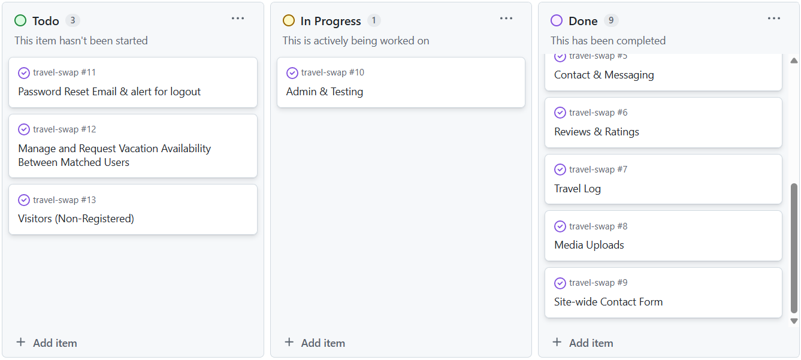
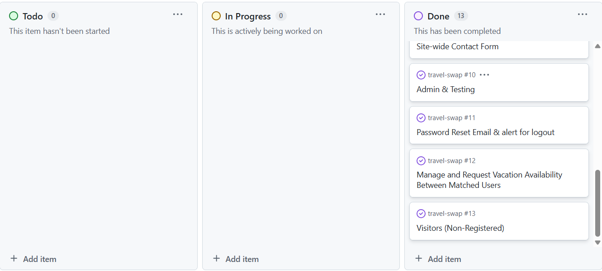
---

## Screenshots

### Home Page

<table>
  <tr>
    <td align="center">
      <br>
      <sub>Laptop View</sub>
    </td>
    <td align="center">
      <br>
      <sub>Laptop View</sub>
    </td>
    <td align="center">
      <br>
      <sub>Mobile View</sub>
    </td>
    <td align="center">
      <br>
      <sub>Mobile View</sub>
    </td>
    <td align="center">
      <br>
      <sub>Mobile View</sub>
    </td>
    <td align="center">
      <br>
      <sub>Mobile View</sub>
    </td>
  </tr>
</table>

### About Page

<table>
  <tr>
    <td align="center">
      <br>
      <sub>Laptop View</sub>
    </td>
    <td align="center">
      <br>
      <sub>Laptop View</sub>
    </td>
    <td align="center">
      <br>
      <sub>Mobile View</sub>
    </td>
    <td align="center">
      <br>
      <sub>Mobile View</sub>
    </td>
    <td align="center">
      <br>
      <sub>Mobile View</sub>
    </td>
    <td align="center">
      <br>
      <sub>Mobile View</sub>
    </td>
  </tr>
</table>

### Travel Log Page

<table>
  <tr>
    <td align="center">
      <br>
      <sub>Laptop View</sub>
    </td>
    <td align="center">
      <br>
      <sub>Laptop View</sub>
    </td>
    <td align="center">
      <br>
      <sub>Mobile View</sub>
    </td>
    <td align="center">
      <br>
      <sub>Mobile View</sub>
    </td>
    <td align="center">
      <br>
      <sub>Mobile View</sub>
    </td>
  </tr>
</table>

### View Profle Page

<table>
  <tr>
    <td align="center">
      <br>
      <sub>Laptop View</sub>
    </td>
    <td align="center">
      <br>
      <sub>Laptop View</sub>
    </td>
    <td align="center">
      <br>
      <sub>Mobile View</sub>
    </td>
    <td align="center">
      <br>
      <sub>Mobile View</sub>
    </td>
    <td align="center">
      <br>
      <sub>Mobile View</sub>
    </td>
    <td align="center">
      <br>
      <sub>Mobile View</sub>
    </td>
    <td align="center">
      <br>
      <sub>Mobile View</sub>
    </td>
  </tr>
</table>

### Profile Page

<table>
  <tr>
    <td align="center">
      <br>
      <sub>Laptop View</sub>
    </td>
    <td align="center">
      <br>
      <sub>Laptop View</sub>
    </td>
    <td align="center">
      <br>
      <sub>Mobile View</sub>
    </td>
    <td align="center">
      <br>
      <sub>Mobile View</sub>
    </td>
    <td align="center">
      <br>
      <sub>Mobile View</sub>
    </td>
    <td align="center">
      <br>
      <sub>Mobile View</sub>
    </td>
  </tr>
</table>

### Edit Profile Page

<table>
  <tr>
    <td align="center">
      <br>
      <sub>Laptop View</sub>
    </td>
    <td align="center">
      <br>
      <sub>Laptop View</sub>
    </td>
    <td align="center">
      <br>
      <sub>Mobile View</sub>
    </td>
    <td align="center">
      <br>
      <sub>Mobile View</sub>
    </td>
    <td align="center">
      <br>
      <sub>Mobile View</sub>
    </td>
    <td align="center">
      <br>
      <sub>Mobile View</sub>
    </td>
  </tr>
</table>

### Login Page

<table>
  <tr>
    <td align="center">
      <br>
      <sub>Laptop View</sub>
    </td>
    <td align="center">
      <br>
      <sub>Mobile View</sub>
    </td>
  </tr>
</table>

### Register Page

<table>
  <tr>
    <td align="center">
      <br>
      <sub>Laptop View</sub>
    </td>
    <td align="center">
      <br>
      <sub>Mobile View</sub>
    </td>
  </tr>
</table>

### 404 Page

<table>
  <tr>
    <td align="center">
      <br>
      <sub>Laptop View</sub>
    </td>
    <td align="center">
      <br>
      <sub>Mobile View</sub>
    </td>
  <tr>
</table>

---

## Wireframes

### Laptop

<table>
  <tr>
    <td align="center">
      <br>
      <sub>Home Page – Laptop View</sub>
    </td>
    <td align="center">
      <br>
      <sub>About Page – Laptop View</sub>
    </td>
    <td align="center">
      <br>
      <sub>Travel Log Page – Laptop View</sub>
    </td>
    <td align="center">
      <br>
      <sub>View Profile Page – Laptop View</sub>
    </td>
  </tr>
  <tr>
    <td align="center">
      <br>
      <sub>Profile Page – Laptop View</sub>
    </td>
    <td align="center">
      <br>
      <sub>Profile Edit Page – Laptop View</sub>
    </td>
        <td align="center">
      <br>
      <sub>Login Page – Laptop View</sub>
    </td>
        <td align="center">
      <br>
      <sub>Register Page – Laptop View</sub>
    </td>
        <td align="center">
      <br>
      <sub>404 Page – Laptop View</sub>
    </td>
  </tr>
</table>

### Mobile

<p align="center">
  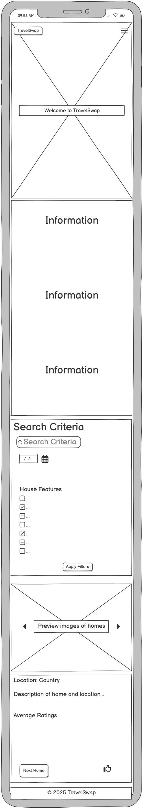
  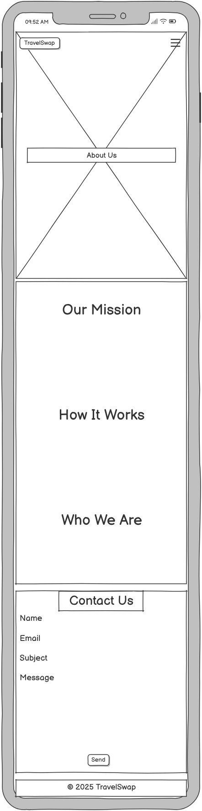
  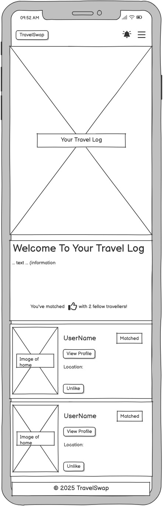
  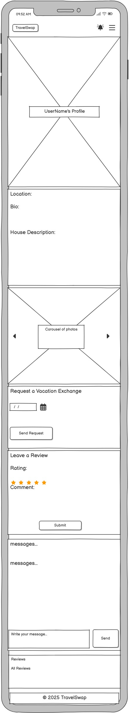
  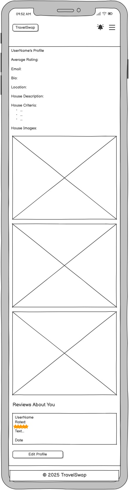
  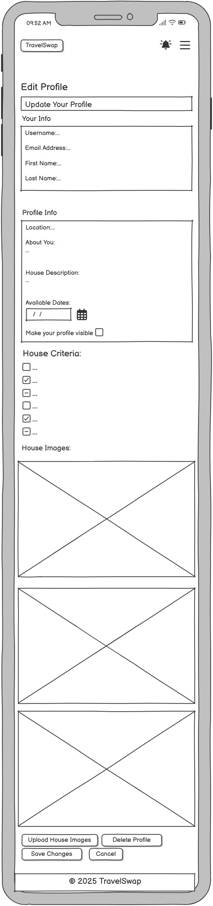
  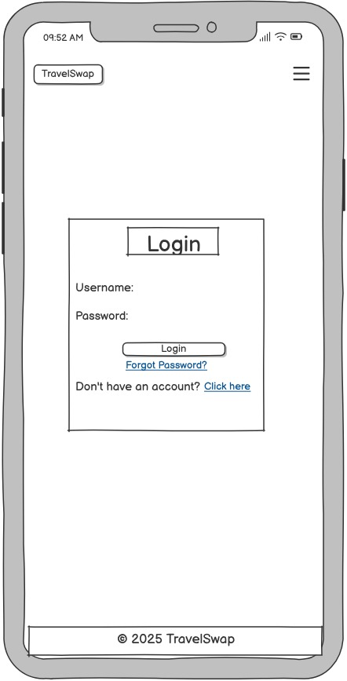
  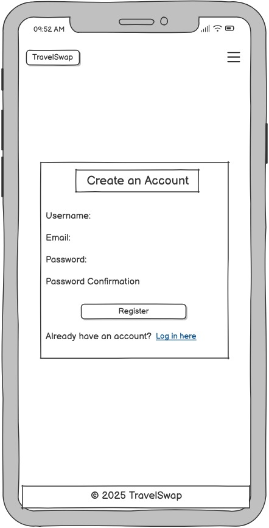
  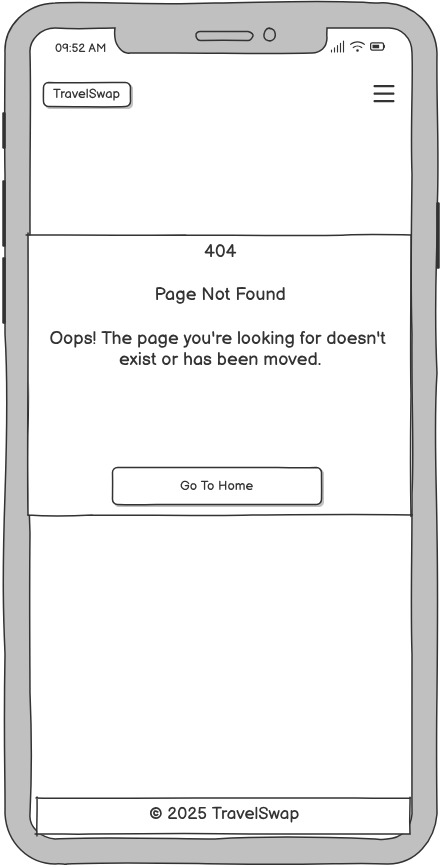
</p>
<p align="center">
  <sub>Mobile wireframes</sub>
</p>

---

## Design

### 🎨 Colour Palette

The TravelSwap platform uses a clean, modern palette to create a warm, trustworthy, and inviting feel:

| Colour        | Hex       | Usage                              |
| ------------- | --------- | ---------------------------------- |
| Deep Sky Blue | `#00BFFF` | Primary buttons and links          |
| Midnight Navy | `#2C3E50` | Header, footer, and base text      |
| Cloud White   | `#F9F9F9` | Background                         |
| Soft Gray     | `#DDDDDD` | Borders, cards, secondary elements |
| Vibrant Coral | `#FF6B6B` | Notifications, alerts, like icons  |

These colours provide high contrast and intuitive UX while keeping a relaxed vacation-inspired vibe.

### 🖋 Fonts

- Primary Font: 'Poppins', sans-serif

- Fallback Fonts: 'Helvetica Neue', Helvetica, Arial, sans-serif

The Poppins font provides a modern, rounded style that balances professionalism with friendliness—ideal for a community-oriented platform like TravelSwap.

---

## Technologies Used

- **Frontend**: HTML5, CSS3, JavaScript, Bootstrap 5
- **Backend**: Python 3, Django
- **Database**: SQLite3 (local), PostgreSQL (production)
- **Media Storage**: Cloudinary
- **Version Control**: Git & GitHub
- **Deployment**: Heroku
- **Others**: AJAX, Django Messages Framework, Django Crispy Forms

---

## Installation

1. Clone this repository:
    ```bash
    git clone https://github.com/your-username/travel-swap.git
    cd travel-swap
    ```

2. Create a virtual environment and install dependencies:
    ```bash
    python3 -m venv env
    source env/bin/activate
    pip install -r requirements.txt
    ```

3. Create a `.env` file and configure:
    ```env
    SECRET_KEY=your_secret_key
    DEBUG=True
    DATABASE_URL=sqlite:///db.sqlite3
    CLOUDINARY_URL=your_cloudinary_url
    ALLOWED_HOSTS=localhost,127.0.0.1
    CSRF_TRUSTED_ORIGINS=http://localhost:8000,http://127.0.0.1:8000
    ```

4. Run migrations and start server:
    ```bash
    python manage.py migrate
    python manage.py runserver
    ```

---

## Usage

- Register an account and create your home profile
- Use the home page to browse and like other properties
- Match and chat with other users
- Arrange home swaps using the booking calendar

---

## Testing

See [TESTING.md](./TESTING.md) for full testing strategy and test results.

Basic test commands:
```bash
python manage.py test
```

---

## 🚀 Deployment

For instructions on running the project locally, see the [Installation](#installation) section above.  
This section explains how to deploy the project to **Heroku** for production.

### Prerequisites
- Heroku account + [Heroku CLI](https://devcenter.heroku.com/articles/heroku-cli) installed
- Cloudinary account (for media storage)
- GitHub repository with your project code
- (Optional) PostgreSQL locally, though Heroku Postgres add-on provides this in production

### Heroku Deployment Steps

1. **Create a new Heroku app** in the Heroku Dashboard (give it a unique name, e.g. `travel-swap-<unique>`).

2. **Add the Heroku Postgres add-on** (Hobby Dev is free).

3. **Set Config Vars** (Settings → Reveal Config Vars):
   - `SECRET_KEY` → your Django secret key
   - `CLOUDINARY_URL` → from Cloudinary dashboard
   - `DATABASE_URL` → auto-added by Heroku Postgres
   - `ALLOWED_HOSTS` → `travel-swap-3f2457e62b46.herokuapp.com`
   - `CSRF_TRUSTED_ORIGINS` → `https://travel-swap-3f2457e62b46.herokuapp.com`
   - `DISABLE_COLLECTSTATIC` → `1` *(first deploy only)*

4. **Buildpacks:** Ensure Python is added. Add Node.js only if your project requires it.

5. **Connect to GitHub** (Deploy tab) → select your repo/branch `main` → click **Deploy Branch**.

6. **Run database migrations**:
   ```bash
   heroku run python manage.py migrate
   heroku run python manage.py createsuperuser
   ```

7. Enable static collection:

- Delete the DISABLE_COLLECTSTATIC config var.

- Redeploy (use “Deploy Branch” again).

8. Your app should now be live at:

https://travel-swap.herokuapp.com/

### Post-Deployment Checks

- Visit the live URL and register a user

- Upload a profile image (tests Cloudinary)

- Like a profile (tests database write)

- If issues occur, check logs:
```bash
heroku logs --tail -a travel-swap
```
### Common Issues

- Collectstatic fails → keep DISABLE_COLLECTSTATIC=1 for first deploy, then unset later.

- CSRF errors → make sure ALLOWED_HOSTS and CSRF_TRUSTED_ORIGINS include your Heroku domain with https://travel-swap-3f2457e62b46.herokuapp.com/.

- 500 errors → check migrations and Config Vars.

- Images not showing → confirm CLOUDINARY_URL.

---

## Credits

- Django documentation
- Bootstrap for styling
- Code Institute for the course scaffold
- Cloudinary for media hosting
- My mentor Jubril Akolade
- My wife for her help and support

---

## Future Features

- Enhanced messaging (read receipts, typing indicators)
- Mobile responsiveness improvements
- Improve UI

---

Happy swapping! 🌍
